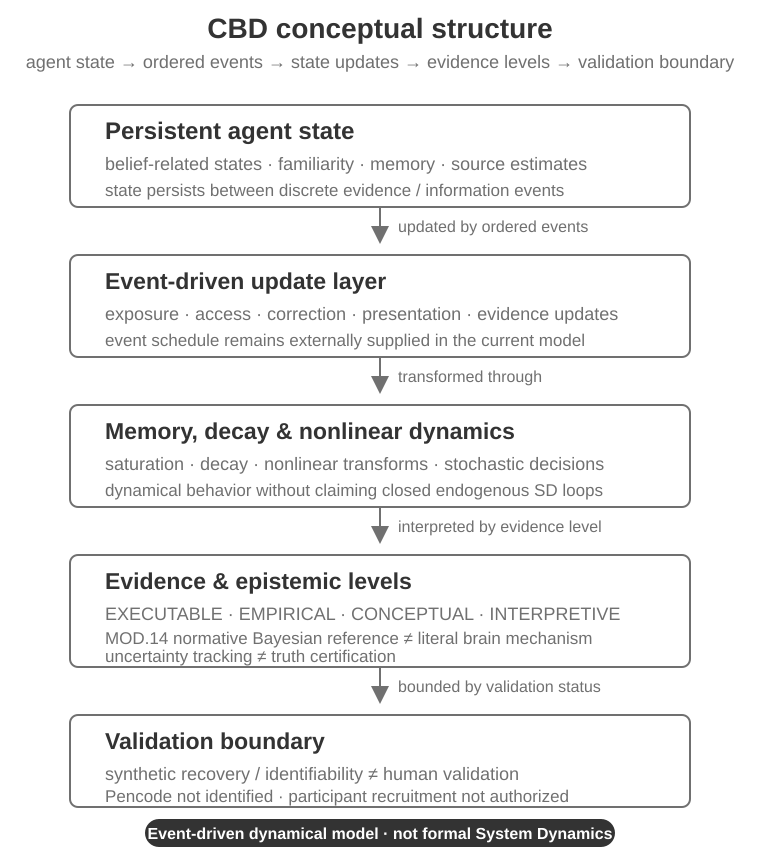

  

<h2 align="center">Cognitive Belief Dynamics (CBD)</h2>

  
  
  

<small><strong>An event-driven cognitive state-transition and agent-level stochastic dynamical model of how information, memory, uncertainty and context can change agent states over time.</strong></small>

<small>
<a href="#what-is-cbd">Overview</a> ·
<a href="#model-at-a-glance">Model structure</a> ·
<a href="#scientific-status">Scientific status</a> ·
<a href="#reproduce-the-computational-baseline">Reproduce</a> ·
<a href="#audit-evidence-and-provenance">Audit & provenance</a> ·
<a href="#continuing-development">Continue work</a>
</small>

---

### What is CBD?

Cognitive Belief Dynamics (CBD) is a scientific model core for representing how persistent agent-level cognitive states can change across ordered information events through memory, saturation, decay, nonlinear transformations and stochastic decisions.

CBD is a **dynamical model informed by systems thinking**, but it is **not currently a formal System Dynamics model**. The current event schedule is externally supplied and a Share action does not automatically create future exposure. Progressive endogenization and feedback-loop closure are an explicit future research direction, not an already implemented capability.

CBD separates executable relations from empirical evidence, conceptual organization and interpretive theory. Synthetic recovery, normative reference calculations and evidence metadata therefore remain bounded by their actual validation status.

### Model at a glance

| Dimension | Current CBD boundary |
| --- | --- |
| Repository version | **v0.1.1 scientific-core maintenance release** |
| Canonical paradigm | Event-driven cognitive state-transition and agent-level stochastic dynamical model |
| Current M0 simulator events | Exposure, Correction, SourceFeedback, Decision |
| Persistent/slow states | Familiarity, corrective-context accessibility, estimated source reliability |
| Core dynamics | Temporal ordering, saturation, decay, nonlinear transformations, seeded stochastic decisions |
| Conceptual registry | 20 modules; conceptual coverage is broader than executable coverage |
| Registered processes | 22 total: 12 implemented M0, 10 candidate |
| Subsystems | 8 total: 4 partial, 3 future, 1 active |
| Evidence levels | EXECUTABLE, EMPIRICAL, CONCEPTUAL, INTERPRETIVE |
| Human validation | Not established |

  <picture>
    <source media="(prefers-color-scheme: dark)" srcset="assets/readme/cbd-concept-overview-dark.svg">
    <source media="(prefers-color-scheme: light)" srcset="assets/readme/cbd-concept-overview-light.svg">
    
  </picture>

The figure is an orientation view, not a causal-loop diagram. It deliberately avoids closed-loop System Dynamics notation because the v0.1.1 model does not yet implement that structure.

### Executable core versus conceptual map

The repository intentionally contains more scientific structure than the currently executable M0 engine. This distinction is part of the model, not unfinished labeling.

The current M0 event engine processes `ExposureEvent`, `CorrectionEvent`, `SourceFeedbackEvent` and `DecisionEvent`. M1 editorial, presentation and access mechanisms are retained as candidate/reference components with dedicated contracts and tests rather than being silently promoted into the M0 runtime.

The eight registered subsystems also carry explicit implementation status. Platform / Network, AI System, and Learning / Adaptation remain **future**. Their presence in the conceptual registry must not be read as evidence that those dynamics already execute.

### Scientific status

| Scientific dimension | Current state |
| --- | --- |
| Formal System Dynamics classification | **No** |
| M1.E4 participant-aware confirmation | **PASS — 18 / 18 primary P64_X10 cells meet the 0.80 recovery gate** |
| Minimum participant-confirmation recovery | **0.92** |
| Phase M protocol robustness | **PROTOCOL_ROBUSTNESS_FAIL — 3 / 18 cells below 0.80; minimum recovery 0.56** |
| Failed Phase M cells | `ITEM_MODERATE__EVSD`, `ITEM_HIGH__EVSD`, `COMBINED_ADVERSE__EVSD` |
| M1.E4 result type | **Synthetic recovery / identifiability-discrimination only** |
| Human-participant validation | **Not established** |
| Pencode | **Not identified or estimated** |
| Participant recruitment | **Not authorized** |
| MOD.14 | Normative Bayesian reference computation with explicit uncertainty; not a population-calibrated cognitive law or truth oracle |

The participant-confirmation pass and Phase M robustness failure answer different questions and must be reported together. The robustness failure is retained as observed; its threshold and failed cells are not post-hoc rewritten.

For the canonical scientific boundary, see [STATUS.md](STATUS.md).

### What v0.1.1 establishes — and what it does not

v0.1.1 provides a versioned scientific core with canonical registries, schemas, model/evidence contracts, a Python reference implementation, retained synthetic benchmarks, authoritative result/provenance artifacts, reproducibility tooling and a tested repository presentation.

It does **not** establish population calibration of the full model, human validation of M1.E4, EVSD or 2HT as human truth, identification of Pencode, authorization for participant recruitment, a general-purpose truth/prediction/diagnostic system, or an end-user production application.

The v0.1.1 maintenance release changes verification, provenance, status reporting, reproducibility metadata and repository presentation. It does **not** change model equations, retained benchmark values, thresholds, seeds or the evidence snapshot.

### Reproduce the computational baseline

CBD requires **Python 3.12 or newer**. The canonical GitHub CI snapshot is scoped to GitHub-hosted Ubuntu and CPython 3.12:

~~~bash
python -m pip install "pip==26.2.1"
python -m pip install -c requirements/ci-py312-linux.lock.txt build pytest hypothesis hatchling
python -m build --no-isolation
python -m pip install -c requirements/ci-py312-linux.lock.txt dist/*.whl
python -m compileall -q src scripts tests
python -m pytest
cemodel validate --root .
~~~

The workflow additionally verifies a clean wheel installation, checks the installed package version, validates bundled registries outside the checkout and runs `cemodel demo`. See [.github/workflows/cbd-validation.yml](.github/workflows/cbd-validation.yml).

The CI lock is an exact platform-scoped reproducibility snapshot, not a universal lock for every operating system. Supported dependency ranges remain in [pyproject.toml](pyproject.toml).

Retained M1.E4 benchmark scripts are under [scripts/](scripts/); results must be interpreted through [model/contracts/](model/contracts/) and their authoritative artifacts.

### Audit, evidence and provenance

The canonical registry validator checks schema conformance, duplicate IDs, module/variable/link references, evidence references, empirical-target links, DOI consistency, the evidence snapshot and the computational-dependency contract.

The retained evidence snapshot is [model/evidence_snapshot.json](model/evidence_snapshot.json), currently bounded to **2026-09-16**. It is explicitly not a systematic review or a calibration dataset. All four current empirical targets are used for **directional validation only**.

Authoritative M1.E4 results and their provenance/checksum artifacts are retained under [model/benchmarks/results/](model/benchmarks/results/). v0.1.1 release traceability is summarized in [releases/v0.1.1.manifest.json](releases/v0.1.1.manifest.json).

### Repository map

| Path | Purpose |
| --- | --- |
| [src/cognitive_epistemic_model/](src/cognitive_epistemic_model/) | Executable computational/reference implementation |
| [model/](model/) | Canonical variables, processes, links, modules, evidence and targets |
| [model/contracts/](model/contracts/) | Evidence, measurement, recovery and world-model contracts |
| [model/benchmarks/](model/benchmarks/) | Frozen synthetic benchmark configurations and retained outputs |
| [schemas/](schemas/) | JSON schemas for canonical artifacts |
| [scripts/](scripts/) | Retained M1.E4 benchmark execution scripts |
| [tests/](tests/) | Scientific, structural, release and regression verification |
| [requirements/](requirements/) | Platform-scoped CI reproducibility snapshot |
| [releases/](releases/) | Frozen release notes and release manifests |
| [DEVELOPMENT.md](DEVELOPMENT.md) | Current audit state, known gaps, next gates and context-loss handoff |

### Continuing development

For a new developer, AI assistant, or future session, start with:

`README.md -> STATUS.md -> DEVELOPMENT.md -> CHANGELOG.md -> CITATION.cff`

Then inspect the latest release/tag, latest green CBD validation run, open issues/PRs, and the contracts/results relevant to the task. [DEVELOPMENT.md](DEVELOPMENT.md) records the source-of-truth hierarchy and current continuation gates.

The next long-term scientific direction is progressive endogenization and feedback-loop closure, tracked in [Issue #110](https://github.com/LaurentiuStaicu/cognitive-belief-dynamics/issues/110). The first candidate is Share -> transmission/network -> delayed Exposure -> Familiarity/Belief -> Action/Share. No such feedback loop is active in v0.1.1.

### Support, citation and license

For reproducible software/test problems or scientific/model concerns, use the structured repository issue forms. See [Contributing](.github/CONTRIBUTING.md) and [Support](.github/SUPPORT.md).

If you use CBD in research, cite the exact released version using [CITATION.cff](CITATION.cff). GitHub releases/tags provide immutable version points; release-specific notes are retained under [releases/](releases/).

CBD is maintained by **Laurentiu Staicu**. Source code and schemas are MIT licensed; original model registries, calibration artifacts, benchmark outputs and other original model data are CC BY 4.0 where applicable. See [LICENSING.md](LICENSING.md).
